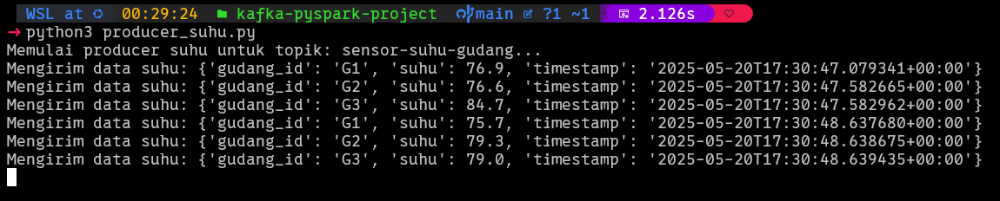
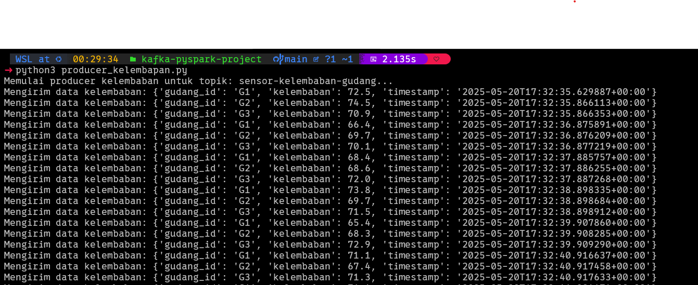
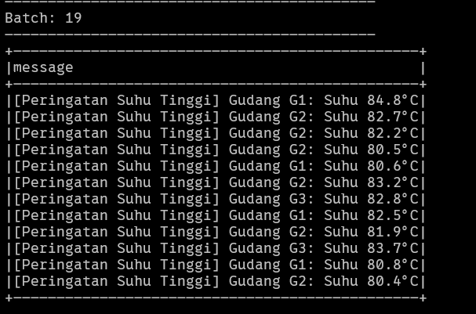
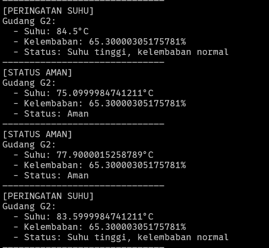
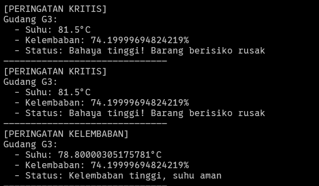

# Tugas Hands On Kafka - Pyspark

**Nama:** Azza Farichi Tjahjono  
**NRP:** 5027231071  

## Komponen Utama

*   **Apache Kafka:** Digunakan sebagai message broker untuk menangani aliran data sensor yang masuk.
*   **Python Kafka Producers (`producer_suhu.py`, `producer_kelembapan.py`):** Mensimulasikan pengiriman data suhu dan kelembaban dari tiga gudang (G1, G2, G3) ke topik Kafka yang sesuai.
*   **Apache Spark (PySpark) (`pyspark_consumer.py`):** Aplikasi Structured Streaming yang mengonsumsi data dari Kafka, melakukan transformasi, filtering, dan join pada stream data untuk menghasilkan peringatan.
*   **Docker & Docker Compose:** Digunakan untuk mengelola dan menjalankan lingkungan Kafka (Zookeeper & Kafka broker) dan Spark (Jupyter Notebook dengan PySpark).

## Cara Menjalankan Tugas

Pastikan Docker dan Docker Compose sudah terinstal di sistem Anda.

### 1. Jalankan Layanan Kafka dan Spark

Buka terminal di direktori root proyek dan jalankan perintah berikut untuk memulai Zookeeper, Kafka, dan container Spark:

```bash
docker compose up -d ; untuk docker compose V2

docker-compose up -d ; untuk docker compose sebelum V2
```

Tunggu beberapa saat hingga semua container berjalan dengan baik. Anda dapat memeriksa status container dengan `docker ps`.

### 2. Jalankan Producer Kafka

Producer akan mengirimkan data sensor ke topik Kafka. Anda perlu menjalankan kedua script producer di terminal terpisah (atau sebagai background process) dari direktori root proyek Anda.

**Producer Suhu:**

```bash
python3 producer_suhu.py
```

**Producer Kelembaban:**

```bash
python3 producer_kelembapan.py
```

Biarkan kedua producer ini berjalan. Mereka akan terus mengirim data setiap detik.

### 3. Jalankan Consumer PySpark

Consumer PySpark akan memproses data dari Kafka. Script ini dijalankan di dalam container Spark.

Buka terminal baru dan masuk ke dalam container Spark:

```bash
docker exec -it spark_pyspark /bin/bash
```

Setelah berada di dalam shell container (`jovyan@<container_id>:/opt/spark/work$`), jalankan script consumer menggunakan `spark-submit`:

```bash
spark-submit \\
--packages org.apache.spark:spark-sql-kafka-0-10_2.12:3.5.0 \\
/home/jovyan/work/pyspark_consumer.py
```
*Catatan: Path `/home/jovyan/work/pyspark_consumer.py` adalah path di dalam container Spark yang telah di-mount melalui `docker-compose.yml`.*

Consumer akan mulai memproses data dan menampilkan output peringatan di konsol terminal tersebut.

### 4. Menghentikan Proyek Tugas

Untuk menghentikan semua layanan:

1.  Hentikan producer Python (Ctrl+C di terminal masing-masing).
2.  Hentikan layanan Docker Compose:

    ```bash
    docker compose down ; jika menggunakan docker compose V2

    docker-compose down ; jika menggunakan docker compose dibawah V2
    ```

## Hasil dan Screenshot

Berikut adalah tempat untuk menyertakan screenshot yang menunjukkan berbagai tahapan dan hasil dari proyek ini.

### 1. Output Producer Suhu





### 2. Output Producer Kelembaban



### 3. Output Consumer PySpark - Peringatan Individual



### 4. Output Consumer PySpark - Peringatan Gabungan (Kritis dan Status Lain)




